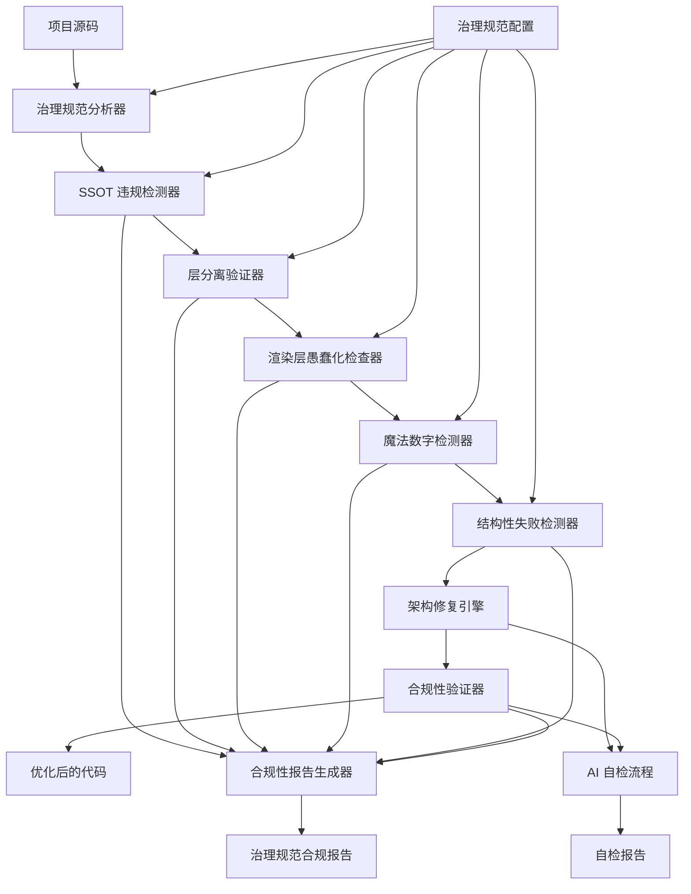

# 项目优化设计文档

## 概述

本设计文档描述了 SolMap 项目的治理规范合规性优化方案。该方案专门设计用于检测、报告和修复违反 `.kiro/specs/solmap-ai-governance.md` 中定义的 Spec-0 到 Spec-8 治理规范的代码。

系统采用静态分析、架构验证和自动化修复相结合的方法，确保项目严格遵循物理系统优先、单一数据源 (SSOT)、层分离和渲染层愚蠢化等核心原则。优化工具将作为架构守护者和物理守护者的自动化实现，防止结构性失败并维护系统的长期可演化性。

## 架构

### 核心架构原则

1. **治理规范优先**: 所有优化决策都基于 Spec-0 到 Spec-8 的治理规范
2. **物理系统优先**: 正确性 > 架构完整性 > 功能实现 > 视觉效果
3. **SSOT 强制执行**: 确保所有物理/天文概念只有唯一权威定义点
4. **层分离验证**: 严格检查和维护架构层之间的边界
5. **结构性失败预防**: 主动检测和预防可能导致结构性失败的模式

### 系统架构图



## 组件和接口

### 1. 治理规范分析器 (GovernanceAnalyzer)

负责解析项目源码并根据 Spec-0 到 Spec-8 进行合规性分析。

```typescript
interface GovernanceAnalyzer {
  analyzeProject(projectPath: string): Promise<GovernanceAnalysis>;
  validateSpec0Compliance(ast: ProjectAST): Spec0Violation[];
  checkPhysicsSystemPriority(ast: ProjectAST): PriorityViolation[];
  detectStructuralFailures(ast: ProjectAST, history: CodeHistory): StructuralFailure[];
}

interface GovernanceAnalysis {
  specViolations: SpecViolation[];
  ssotViolations: SSOTViolation[];
  layerViolations: LayerViolation[];
  renderingViolations: RenderingViolation[];
  magicNumbers: MagicNumberViolation[];
  structuralFailures: StructuralFailure[];
}

interface SpecViolation {
  specNumber: string; // "Spec-0", "Spec-1", etc.
  violationType: ViolationType;
  location: SourceLocation;
  description: string;
  governanceReference: string;
  severity: ViolationSeverity;
}
```

### 2. SSOT 违规检测器 (SSOTViolationDetector)

检测违反单一数据源原则的代码，确保物理/天文概念只有唯一权威定义。

```typescript
interface SSOTViolationDetector {
  detectDuplicateDefinitions(ast: ProjectAST): DuplicateDefinition[];
  validatePhysicsConstants(ast: ProjectAST): PhysicsConstantViolation[];
  checkAuthorityDefinitions(ast: ProjectAST): AuthorityViolation[];
  validateConstantsDirectory(constantsPath: string): ConstantsViolation[];
}

interface DuplicateDefinition {
  concept: PhysicsConcept;
  authorityLocation: SourceLocation;
  duplicateLocations: SourceLocation[];
  violationSeverity: ViolationSeverity;
}

interface PhysicsConstantViolation {
  constantType: PhysicsConstantType; // 'axialTilt' | 'physicalParams' | 'rotation' | 'referenceFrames'
  expectedSource: string;
  actualSource: string;
  location: SourceLocation;
}

enum PhysicsConstantType {
  AXIAL_TILT = 'axialTilt',
  PHYSICAL_PARAMS = 'physicalParams',
  ROTATION = 'rotation',
  REFERENCE_FRAMES = 'referenceFrames'
}
```

### 3. 层分离验证器 (LayerSeparationValidator)

验证架构层之间的严格分离，检测跨层访问和依赖违规。

```typescript
interface LayerSeparationValidator {
  validateLayerBoundaries(ast: ProjectAST): LayerViolation[];
  checkCrossLayerImports(dependencies: DependencyGraph): CrossLayerImport[];
  validateDependencyDirection(dependencies: DependencyGraph): DependencyViolation[];
  checkSingleResponsibility(modules: ModuleInfo[]): ResponsibilityViolation[];
}

interface LayerViolation {
  violatingModule: string;
  targetLayer: ArchitectureLayer;
  sourceLayer: ArchitectureLayer;
  violationType: LayerViolationType;
  location: SourceLocation;
}

enum ArchitectureLayer {
  RENDERING = 'rendering',
  PHYSICS = 'physics',
  ASTRONOMY = 'astronomy',
  CONSTANTS = 'constants',
  INFRASTRUCTURE = 'infrastructure'
}

enum LayerViolationType {
  CROSS_LAYER_IMPORT = 'cross_layer_import',
  WRONG_DEPENDENCY_DIRECTION = 'wrong_dependency_direction',
  MIXED_RESPONSIBILITIES = 'mixed_responsibilities'
}
```

### 4. 渲染层愚蠢化检查器 (RendererStupidityChecker)

确保渲染层保持愚蠢化，不进行物理推导或解释。

```typescript
interface RendererStupidityChecker {
  checkRendererInputs(rendererModules: ModuleInfo[]): RendererInputViolation[];
  detectPhysicsKnowledge(rendererCode: string[]): PhysicsKnowledgeViolation[];
  validateRendererImports(imports: ImportInfo[]): RendererImportViolation[];
  checkComputationLogic(rendererAST: FileAST[]): ComputationViolation[];
}

interface RendererInputViolation {
  rendererModule: string;
  allowedInputs: string[]; // ['positionVector', 'attitudeMatrix', 'visualParams']
  actualInputs: string[];
  violations: string[];
  location: SourceLocation;
}

interface PhysicsKnowledgeViolation {
  rendererModule: string;
  forbiddenConcepts: string[]; // ['axialTilt', 'period', 'referenceFrame']
  detectedConcepts: string[];
  location: SourceLocation;
}
```

### 5. 魔法数字检测器 (MagicNumberDetector)

检测和消除代码中的硬编码物理常量和配置值。

```typescript
interface MagicNumberDetector {
  detectHardcodedConstants(ast: ProjectAST): MagicNumberViolation[];
  validateConstantSources(constants: ConstantUsage[]): ConstantSourceViolation[];
  checkUnitClarity(values: NumericValue[]): UnitClarityViolation[];
  detectConfigurationValues(ast: ProjectAST): ConfigurationViolation[];
}

interface MagicNumberViolation {
  value: number | string;
  location: SourceLocation;
  suspectedType: PhysicsConstantType;
  suggestedSource: string;
  context: string;
}

interface ConstantSourceViolation {
  constantName: string;
  expectedSource: string;
  actualSource: string;
  location: SourceLocation;
}
```

### 6. 结构性失败检测器 (StructuralFailureDetector)

检测可能导致结构性失败的模式，预防重复修改同一问题。

```typescript
interface StructuralFailureDetector {
  analyzeModificationHistory(history: CodeHistory): StructuralFailure[];
  detectInstabilityPatterns(testResults: TestHistory[], visualResults: VisualHistory[]): InstabilityPattern[];
  checkParameterTuning(codeChanges: CodeChange[]): ParameterTuningViolation[];
  identifyRefactoringNeeds(violations: SpecViolation[]): RefactoringRecommendation[];
}

interface StructuralFailure {
  problemArea: string;
  modificationCount: number;
  modificationHistory: ModificationRecord[];
  failureType: StructuralFailureType;
  refactoringUrgency: RefactoringUrgency;
}

enum StructuralFailureType {
  REPEATED_MODIFICATIONS = 'repeated_modifications',
  VISUAL_INSTABILITY = 'visual_instability',
  PARAMETER_TUNING = 'parameter_tuning',
  ARCHITECTURE_DRIFT = 'architecture_drift'
}
```

### 7. 架构修复引擎 (ArchitectureRepairEngine)

执行符合治理规范的代码修复和重构操作。

```typescript
interface ArchitectureRepairEngine {
  repairSSOTViolations(violations: SSOTViolation[]): RepairResult;
  fixLayerSeparation(violations: LayerViolation[]): RepairResult;
  stupidifyRenderer(violations: RendererViolation[]): RepairResult;
  eliminateMagicNumbers(violations: MagicNumberViolation[]): RepairResult;
  triggerStructuralRefactoring(failures: StructuralFailure[]): RefactoringPlan;
}

interface RepairResult {
  success: boolean;
  repairedViolations: SpecViolation[];
  codeChanges: CodeChange[];
  remainingViolations: SpecViolation[];
  warnings: string[];
}

interface RefactoringPlan {
  freezeRecommendation: boolean;
  refactoringSteps: RefactoringStep[];
  estimatedEffort: RefactoringEffort;
  riskAssessment: RiskAssessment;
}
```

## 数据模型

### 核心数据结构

```typescript
// 治理规范表示
interface GovernanceSpec {
  specNumber: string; // "Spec-0", "Spec-1", etc.
  title: string;
  rules: GovernanceRule[];
  constraints: GovernanceConstraint[];
  failureConditions: FailureCondition[];
}

// 治理规范规则
interface GovernanceRule {
  id: string;
  description: string;
  ruleType: GovernanceRuleType;
  enforcementLevel: EnforcementLevel;
  validationCriteria: ValidationCriteria[];
}

enum GovernanceRuleType {
  SSOT_ENFORCEMENT = 'ssot_enforcement',
  LAYER_SEPARATION = 'layer_separation',
  RENDERER_STUPIDITY = 'renderer_stupidity',
  MAGIC_NUMBER_ELIMINATION = 'magic_number_elimination',
  STRUCTURAL_FAILURE_PREVENTION = 'structural_failure_prevention'
}

// 物理概念定义
interface PhysicsConcept {
  name: string;
  type: PhysicsConceptType;
  authoritySource: string;
  allowedUsagePatterns: UsagePattern[];
  forbiddenContexts: string[];
}

enum PhysicsConceptType {
  AXIAL_TILT = 'axial_tilt',
  PHYSICAL_PARAMETER = 'physical_parameter',
  ROTATION_PERIOD = 'rotation_period',
  ORBITAL_PERIOD = 'orbital_period',
  REFERENCE_FRAME = 'reference_frame'
}

// 架构层定义
interface ArchitectureLayerDefinition {
  name: ArchitectureLayer;
  allowedDependencies: ArchitectureLayer[];
  forbiddenImports: string[];
  allowedOperations: LayerOperation[];
  responsibilityBoundaries: string[];
}

enum LayerOperation {
  RENDER_ONLY = 'render_only',
  COMPUTE_PHYSICS = 'compute_physics',
  DEFINE_CONSTANTS = 'define_constants',
  MANAGE_INFRASTRUCTURE = 'manage_infrastructure'
}

// 违规记录
interface ViolationRecord {
  id: string;
  specViolation: SpecViolation;
  detectionTimestamp: Date;
  fixAttempts: FixAttempt[];
  currentStatus: ViolationStatus;
  structuralRisk: StructuralRisk;
}

enum ViolationStatus {
  DETECTED = 'detected',
  FIXING = 'fixing',
  FIXED = 'fixed',
  STRUCTURAL_FAILURE = 'structural_failure'
}

// AI 自检数据
interface AIPreCommitCheck {
  checkId: string;
  questions: PreCommitQuestion[];
  answers: PreCommitAnswer[];
  overallResult: PreCommitResult;
  blockingIssues: string[];
}

interface PreCommitQuestion {
  question: string;
  category: PreCommitCategory;
  required: boolean;
}

enum PreCommitCategory {
  NEW_DEFINITIONS = 'new_definitions',
  UNIT_CLARITY = 'unit_clarity',
  COMPUTATION_LAYER = 'computation_layer',
  STRUCTURAL_IMPACT = 'structural_impact'
}
```

### 治理规范配置

```typescript
// 治理规范配置
interface GovernanceConfig {
  enabledSpecs: string[];
  ssotConfiguration: SSOTConfig;
  layerSeparationRules: LayerSeparationConfig;
  rendererStupidityRules: RendererStupidityConfig;
  structuralFailureThresholds: StructuralFailureConfig;
}

interface SSOTConfig {
  authorityDefinitions: AuthorityDefinition[];
  allowedDuplicationExceptions: string[];
  constantsDirectoryPath: string;
  enforcementStrictness: EnforcementStrictness;
}

interface AuthorityDefinition {
  concept: PhysicsConceptType;
  authorityFile: string;
  allowedAccessPatterns: string[];
  forbiddenUsageContexts: string[];
}

enum EnforcementStrictness {
  STRICT = 'strict',
  MODERATE = 'moderate',
  LENIENT = 'lenient'
}
```

## 正确性属性

*属性是一个特征或行为，应该在系统的所有有效执行中保持为真——本质上是关于系统应该做什么的正式声明。属性作为人类可读规范和机器可验证正确性保证之间的桥梁。*

基于预工作分析，以下是项目优化系统的正确性属性：

### 属性 1: 治理规范违规检测完整性
*对于任何* 包含违反 Spec-0 到 Spec-8 治理规范的代码项目，检测系统应该能够识别所有违规实例并提供正确的规范引用
**验证: 需求 1.1, 1.2, 1.3, 1.4, 1.5**

### 属性 2: SSOT 原则强制执行准确性
*对于任何* 物理或天文概念，系统应该确保该概念只存在唯一的权威定义点，并检测所有重复定义
**验证: 需求 2.1, 2.2, 2.3, 2.4, 2.5**

### 属性 3: 渲染层愚蠢化验证严格性
*对于任何* 渲染层代码，系统应该确保渲染器只接收允许的输入类型，不包含物理推导或解释逻辑
**验证: 需求 3.1, 3.2, 3.3, 3.4, 3.5**

### 属性 4: 魔法数字检测全面性
*对于任何* 包含硬编码物理常量或配置值的代码，系统应该能够检测所有魔法数字并提供权威来源建议
**验证: 需求 4.1, 4.2, 4.3, 4.4, 4.5**

### 属性 5: 结构性失败预防有效性
*对于任何* 代码修改历史，系统应该能够识别重复修改模式并在达到结构性失败阈值前发出警告
**验证: 需求 5.1, 5.2, 5.3, 5.4, 5.5**

### 属性 6: 层分离强制执行准确性
*对于任何* 跨层导入或依赖关系，系统应该能够检测所有违反架构层分离的代码并拒绝结构错误的实现
**验证: 需求 6.1, 6.2, 6.3, 6.4, 6.5**

### 属性 7: 常量文件纯净性维护严格性
*对于任何* 常量文件，系统应该确保文件只包含常量和冻结对象，不包含任何逻辑或计算代码
**验证: 需求 7.1, 7.2, 7.3, 7.4, 7.5**

### 属性 8: AI 自检流程完整性
*对于任何* 代码提交，AI 自检流程应该能够验证关键治理问题并在无法确认合规性时阻止提交
**验证: 需求 8.1, 8.2, 8.3, 8.4, 8.5**

### 属性 9: 治理教育建议准确性
*对于任何* 检测到的违规，系统应该提供准确的治理规范引用、符合 SSOT 原则的修复建议和最佳实践指导
**验证: 需求 9.1, 9.2, 9.3, 9.4, 9.5**

### 属性 10: 持续监控报告完整性
*对于任何* 项目状态，监控系统应该提供完整的合规性报告、准确的趋势分析和及时的预警通知
**验证: 需求 10.1, 10.2, 10.3, 10.4, 10.5**

## 错误处理

### 治理规范违规处理策略

1. **Spec-0 违规 (最高约束)**: 立即停止处理，标记为结构性失败
   - 策略: 冻结功能开发，触发架构审查
   - 恢复: 必须通过架构守护者审批才能继续

2. **SSOT 违规**: 阻止代码提交，要求立即修复
   - 策略: 提供权威定义位置，生成迁移计划
   - 恢复: 自动重构到正确的权威定义点

3. **层分离违规**: 拒绝跨层访问，强制架构边界
   - 策略: 阻止编译，提供正确的访问路径
   - 恢复: 重构为符合层分离的实现

4. **渲染层智能化**: 立即回滚，移除物理逻辑
   - 策略: 将计算逻辑移至正确的层级
   - 恢复: 提供愚蠢化的渲染器实现

5. **结构性失败**: 触发重构流程，暂停功能开发
   - 策略: 分析失败模式，制定重构计划
   - 恢复: 完成结构性重构后才能继续开发

### 治理规范错误恢复机制

```typescript
interface GovernanceErrorRecovery {
  handleSpecViolation(violation: SpecViolation): RecoveryPlan;
  triggerStructuralRefactoring(failure: StructuralFailure): RefactoringPlan;
  freezeDevelopment(reason: FreezeReason): DevelopmentFreeze;
  escalateToHuman(issue: CriticalIssue): HumanEscalation;
}

interface RecoveryPlan {
  immediateActions: RecoveryAction[];
  refactoringSteps: RefactoringStep[];
  validationCriteria: ValidationCriteria[];
  rollbackPlan: RollbackPlan;
}

enum FreezeReason {
  STRUCTURAL_FAILURE = 'structural_failure',
  SPEC_0_VIOLATION = 'spec_0_violation',
  REPEATED_VIOLATIONS = 'repeated_violations',
  ARCHITECTURE_CORRUPTION = 'architecture_corruption'
}
```

## 测试策略

### 双重测试方法

项目优化系统将采用单元测试和属性测试相结合的方法：

**单元测试**:
- 验证具体的治理规范违规检测场景
- 测试特定的 SSOT 违规和层分离问题
- 验证错误处理和恢复机制
- 测试 AI 自检流程的边界条件

**属性测试**:
- 验证治理规范检测的通用属性
- 使用随机生成的代码结构进行全面测试
- 每个属性测试运行最少 100 次迭代

### 属性测试配置

使用 fast-check 库进行属性测试，每个测试用例标记格式：
**Feature: project-optimization, Property {number}: {property_text}**

### 治理规范测试策略

1. **Spec-0 合规性测试**: 验证物理系统优先原则的检测
2. **SSOT 强制执行测试**: 验证单一数据源原则的严格执行
3. **层分离验证测试**: 验证架构边界的严格维护
4. **渲染层愚蠢化测试**: 验证渲染器智能化的检测和阻止
5. **魔法数字检测测试**: 验证硬编码常量的全面识别
6. **结构性失败预防测试**: 验证重复修改模式的早期检测

### 治理规范模拟测试

1. **违规代码生成**: 生成各种违反治理规范的代码样本
2. **架构腐化模拟**: 模拟架构逐渐腐化的过程
3. **结构性失败场景**: 模拟导致结构性失败的修改模式
4. **AI 自检流程测试**: 模拟各种自检场景和失败条件

### 集成测试

1. **完整治理流程测试**: 测试从检测到修复的完整流程
2. **多规范冲突测试**: 测试多个治理规范同时违规的处理
3. **大型项目测试**: 在包含复杂架构的项目上测试性能
4. **持续监控测试**: 验证持续合规性监控的有效性

### 回归测试

1. **治理规范回归**: 确保修复后的代码严格遵循治理规范
2. **架构完整性回归**: 确保架构修复不破坏其他架构约束
3. **功能保持回归**: 确保治理规范修复不影响功能正确性
4. **性能影响回归**: 确保治理规范强制执行不显著影响性能