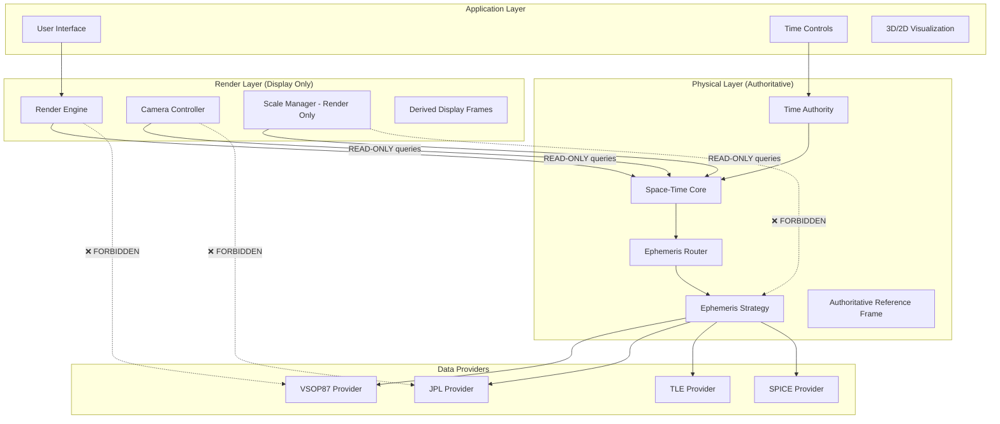

# Design Document: Space-Time Foundation Architecture

## Overview

The Space-Time Foundation transforms the current solar system simulator into a trustworthy aerospace coordinate and time foundation. This design establishes a clean separation between physical astronomical calculations and visual rendering, creating a reliable base for future aerospace applications.

The system follows a strict layered architecture where the Physical Layer maintains astronomical accuracy using real units and reference frames, while the Render Layer handles visualization without affecting physical calculations. A single Time Authority ensures temporal consistency across all components.

## Architecture

### High-Level Architecture



### Layer Responsibilities

**Application Layer**: User interaction, controls, and high-level visualization coordination
**Render Layer**: Visual representation, camera control, and display scaling (no physical calculations)
**Physical Layer**: Astronomical computations, coordinate systems, and time management
**Data Providers**: Astronomical data sources implementing the Ephemeris Provider interface

## Components and Interfaces

### Space-Time Core

The central component managing coordinate systems and state queries. **CRITICAL**: Render Layer can ONLY access read-only query methods.

```typescript
interface SpaceTimeCore {
  // READ-ONLY queries (Render Layer allowed)
  getBodyState(bodyId: string, julianDate: number): StateVector;
  getBodiesState(bodyIds: string[], julianDate: number): Map<string, StateVector>;
  getBodyHierarchy(bodyId: string): BodyHierarchy;
  getReferenceFrameInfo(): ReferenceFrameInfo;
  
  // WRITE operations (Physical Layer only - Render Layer FORBIDDEN)
  // These methods should not be accessible to Render Layer
  registerEphemerisProvider(provider: EphemerisProvider): void;
  setProviderPriority(bodyId: string, providerIds: string[]): void;
}
```

interface StateVector {
  // Position of body's center of mass in authoritative reference frame (km)
  position: Vector3;
  
  // Velocity as d(position)/dt in same reference frame (km/s)
  velocity: Vector3;
  
  // Physical radius of the body (km)
  radius: number;
  
  // Metadata about the state
  metadata: StateMetadata;
}

interface StateMetadata {
  // Julian Date of this state
  julianDate: number;
  
  // Reference frame identifier
  referenceFrame: string;
  
  // Data source provider
  provider: string;
  
  // Calculation accuracy/uncertainty
  accuracy?: number;
}
```

### Time Authority

Single source of truth for time progression with quantified continuity constraints.

```typescript
interface TimeAuthority {
  // Current system time
  getCurrentJulianDate(): number;
  
  // Time progression control with continuity constraints
  setTimeSpeed(speedMultiplier: number): void;
  setTime(julianDate: number): void;
  
  // Subscription for time updates
  subscribe(callback: (jd: number) => void): UnsubscribeFunction;
  
  // Time validation with quantified limits
  validateTimeProgression(fromJD: number, toJD: number, speed: number): boolean;
}

// Quantified Time Continuity Standards
interface TimeContinuityConstraints {
  // Maximum allowed time jump in single update (days)
  maxTimeJumpDays: 1.0; // Prevent discontinuities > 1 day
  
  // Maximum time speed multiplier
  maxSpeedMultiplier: 1000000; // 1 million x real-time max
  
  // Minimum time precision (days)
  minTimePrecision: 1e-10; // ~0.01 seconds precision
  
  // Maximum time range (Julian Date bounds)
  minJulianDate: 1721425.5; // Year 1 CE
  maxJulianDate: 5373484.5; // Year 9999 CE
}
```
```

### Ephemeris Provider Interface

Standardized interface for astronomical data sources.

```typescript
interface EphemerisProvider {
  // Provider identification
  getProviderId(): string;
  getSupportedBodies(): string[];
  getTimeRange(): { startJD: number; endJD: number };
  
  // Core state calculation
  getState(bodyId: string, julianDate: number): StateVector;
  
  // Bulk calculation for efficiency
  getStates(bodyId: string, julianDates: number[]): StateVector[];
  
  // Provider capabilities
  getAccuracy(bodyId: string): number;
  supportsVelocity(): boolean;
}
```

### Ephemeris Router

Routes state queries to appropriate providers. **Separated into Router + Strategy for clarity**.

```typescript
interface EphemerisRouter {
  // Core routing (lightweight)
  getState(bodyId: string, julianDate: number): StateVector;
  getStates(bodyId: string, julianDates: number[]): StateVector[];
}

interface EphemerisStrategy {
  // Provider management (separate responsibility)
  registerProvider(provider: EphemerisProvider): void;
  setProviderPriority(bodyId: string, providerIds: string[]): void;
  selectProvider(bodyId: string, julianDate: number): EphemerisProvider;
}
```
```

## Data Models

### Reference Frame Definition

```typescript
interface ReferenceFrameInfo {
  // Frame identifier
  frameId: string; // "ICRF_J2000_HELIOCENTRIC"
  
  // Frame description
  name: string; // "Heliocentric Inertial ICRF/J2000"
  origin: string; // "Sun Center"
  axes: string; // "ICRF J2000.0"
  
  // Frame type (Phase 1: only authoritative allowed in Physical Layer)
  type: "AUTHORITATIVE" | "DERIVED_DISPLAY";
  
  // CRITICAL: DERIVED_DISPLAY frames exist ONLY in Render Layer
  // They NEVER participate in Physical Layer calculations
  // They are used only for camera transforms and display purposes
  
  // Units
  positionUnit: string; // "km"
  velocityUnit: string; // "km/s"
  timeUnit: string; // "JD"
}
```
```

### Body Hierarchy

```typescript
interface BodyHierarchy {
  bodyId: string;
  parentId?: string;
  children: string[];
  hierarchyLevel: number; // 0=star, 1=planet, 2=satellite
}
```

### Scale Strategy (Render Layer Only)

**CRITICAL**: This exists ONLY in Render Layer, never in Physical Layer.

```typescript
interface ScaleStrategy {
  // Physical coordinates (READ-ONLY reference from Physical Layer)
  physicalPosition: Readonly<Vector3>; // km - never modified
  
  // Display coordinates (Render Layer calculations only)
  displayPosition: Vector3; // scaled for visualization
  
  // Scale factors (Render Layer only)
  visualScale: number; // logarithmic/non-linear scaling
  realScale: number; // linear scaling
  
  // Camera transforms (Render Layer only - separate from physical position)
  cameraTransform: Matrix4;
}
```
```

## Correctness Properties

*A property is a characteristic or behavior that should hold true across all valid executions of a system-essentially, a formal statement about what the system should do. Properties serve as the bridge between human-readable specifications and machine-verifiable correctness guarantees.*

### Property 1: Single Authoritative Reference Frame
*For any* system configuration, there should be exactly one reference frame marked as "AUTHORITATIVE" type, and all others should be "DERIVED_DISPLAY" type.
**Validates: Requirements 1.1, 1.3**

### Property 2: Reference Frame Consistency
*For any* state query, the returned StateVector metadata should always indicate the same authoritative reference frame identifier.
**Validates: Requirements 1.2, 2.1**

### Property 3: Physical Units Consistency
*For any* celestial body state query, the position should be in kilometers, velocity in km/s, radius in kilometers, and time in Julian Date.
**Validates: Requirements 2.1, 2.2**

### Property 4: State Vector Purity
*For any* state vector returned by the system, all numeric values should represent physical quantities only, never scaled or transformed values.
**Validates: Requirements 2.6**

### Property 5: Time Authority Exclusivity
*For any* time modification operation, only the Time Authority component should be able to change system time, and all other components should receive time through subscriptions.
**Validates: Requirements 3.1, 3.2**

### Property 6: Layer Separation Integrity
*For any* render layer operation, the render layer should only access StateVector data through the defined interface, never directly accessing VSOP87, JPL, or other astronomical computation modules.
**Validates: Requirements 4.1, 4.2**

### Property 7: Provider Interface Compliance
*For any* Ephemeris Provider implementation, the returned data should conform to the StateVector interface with complete metadata.
**Validates: Requirements 5.5**

### Property 8: Physical-Render Separation
*For any* camera or zoom operation, the underlying physical positions in StateVectors should remain unchanged while only display transforms are modified.
**Validates: Requirements 6.3**

### Property 9: Time Continuity Preservation
*For any* time progression operation, the Julian Date should change continuously without discontinuities that would break numerical calculations.
**Validates: Requirements 9.1, 9.4**

## Error Handling

### Time Authority Errors
- **Invalid Time Range**: Reject time values outside provider capabilities
- **Time Discontinuity**: Prevent time jumps that exceed physical plausibility
- **Subscription Failures**: Handle component disconnections gracefully

### Ephemeris Provider Errors
- **Data Unavailable**: Return clear error when body/time combination not supported
- **Calculation Failure**: Provide fallback or error state for failed calculations
- **Provider Offline**: Route to alternative providers when primary fails

### State Query Errors
- **Invalid Body ID**: Return structured error for unknown celestial bodies
- **Out of Range**: Clear error when requested time outside provider range
- **Precision Loss**: Warning when calculation precision falls below thresholds

### Layer Boundary Violations
- **Unauthorized Access**: Prevent render layer from accessing prohibited modules
- **Interface Violations**: Reject data that doesn't conform to StateVector format
- **Reference Frame Errors**: Block operations that would create multiple authoritative frames

## Testing Strategy

### Dual Testing Approach
The system requires both unit testing and property-based testing for comprehensive validation:

**Unit Tests**: Verify specific examples, edge cases, and error conditions
- Test specific Julian Date calculations
- Verify error handling for invalid inputs
- Test component integration points
- Validate reference frame transformations

**Property Tests**: Verify universal properties across all inputs
- Test state vector consistency across random time ranges
- Verify reference frame integrity with random body queries
- Test time authority exclusivity with concurrent operations
- Validate layer separation with random access patterns

### Property-Based Testing Configuration
- **Framework**: Use fast-check for TypeScript/JavaScript property testing
- **Iterations**: Minimum 100 iterations per property test
- **Test Tags**: Each property test tagged with: **Feature: space-time-foundation, Property {number}: {property_text}**

### Testing Implementation Requirements
- Each correctness property must be implemented as a single property-based test
- Property tests should generate random valid inputs (body IDs, Julian Dates, etc.)
- Unit tests should focus on specific examples and integration scenarios
- All tests must validate against the actual system implementation, not mocks

<function_calls>
<invoke name="prework">
<parameter name="featureName">space-time-foundation