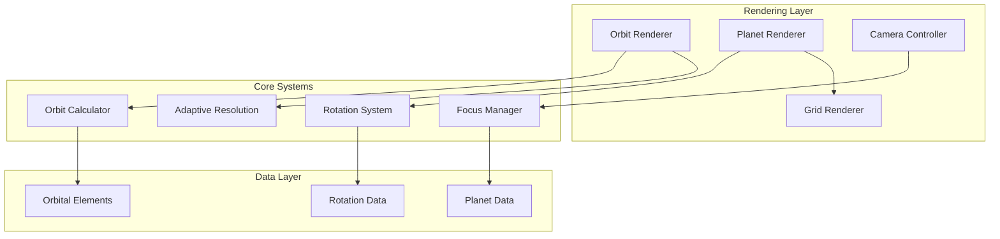

# Design Document: Visual Rendering Fixes

## Overview

This design addresses critical visual rendering and interaction issues in the solar system simulator. The solution focuses on four main areas: orbit rendering continuity, camera focus behavior, planet rotation implementation, and surface grid positioning. The design emphasizes maintaining scientific accuracy while providing smooth, professional user interactions.

The approach involves refactoring existing rendering components to use adaptive algorithms, implementing proper coordinate system alignment, and adding missing rotation systems. All fixes are designed to maintain or improve performance while eliminating visual artifacts.

## Architecture

### High-Level Architecture



### Component Responsibilities

**Orbit Renderer**: Generates smooth, continuous orbital paths with adaptive resolution
**Planet Renderer**: Handles planet mesh rendering, rotation, and surface features
**Grid Renderer**: Manages latitude/longitude grid positioning and visibility
**Camera Controller**: Manages focus operations and penetration prevention
**Rotation System**: Implements realistic planet self-rotation
**Focus Manager**: Calculates appropriate focus distances and transitions

## Components and Interfaces

### Adaptive Orbit Renderer

Enhanced orbit rendering system that eliminates segmentation artifacts.

```typescript
interface AdaptiveOrbitRenderer {
  // Adaptive curve generation
  generateOrbitCurve(elements: OrbitalElements, viewDistance: number): OrbitCurve;
  updateCurveResolution(curve: OrbitCurve, cameraDistance: number): void;
  
  // Planet-orbit alignment
  alignPlanetToOrbit(planet: Planet, orbit: OrbitCurve, time: number): void;
  validateOrbitAccuracy(planet: Planet, orbit: OrbitCurve): number;
  
  // Performance optimization
  getCurveResolution(distance: number): number;
  shouldUpdateCurve(curve: OrbitCurve, camera: Camera): boolean;
}

interface OrbitCurve {
  points: Vector3[];
  resolution: number;
  lastUpdateDistance: number;
  
  // Curve properties
  getPointAtTime(time: number): Vector3;
  getClosestPoint(position: Vector3): Vector3;
  getTangentAtTime(time: number): Vector3;
}
```

### Enhanced Camera Focus System

Improved focus system that prevents penetration and provides smooth transitions.

```typescript
interface EnhancedFocusManager {
  // Focus operations
  focusOnObject(object: CelestialObject, options?: FocusOptions): void;
  calculateFocusDistance(object: CelestialObject): number;
  
  // Penetration prevention
  checkPenetration(camera: Camera, target: CelestialObject): boolean;
  applyPenetrationConstraints(camera: Camera, target: CelestialObject): void;
  
  // Transition management
  updateFocusTransition(deltaTime: number): void;
  interruptTransition(): void;
}

interface FocusOptions {
  distance?: number;
  transitionDuration?: number;
  allowUserInterrupt?: boolean;
  maintainOrientation?: boolean;
}

interface PenetrationConstraint {
  minDistance: number;
  safetyMultiplier: number;
  smoothingFactor: number;
  enabled: boolean;
}
```

### Planet Rotation System

New system for implementing realistic planet self-rotation.

```typescript
interface PlanetRotationSystem {
  // Rotation management
  initializeRotation(planet: Planet): void;
  updateRotation(planet: Planet, deltaTime: number): void;
  
  // Rotation data
  getRotationSpeed(planetName: string): number;
  setRotationSpeed(planetName: string, speed: number): void;
  
  // Animation
  interpolateRotation(current: number, target: number, factor: number): number;
  validateRotationSmoothness(planet: Planet): boolean;
}

interface RotationData {
  // Rotation speeds in radians per second
  rotationSpeeds: Record<string, number>;
  
  // Special cases
  retrogradeRotation: string[]; // Planets with retrograde rotation
  tidally_locked: string[]; // Tidally locked bodies
}

// Scientific rotation periods (converted to radians/second)
const ROTATION_PERIODS = {
  sun: 27 * 24 * 3600,      // 27 days
  mercury: 58.6 * 24 * 3600, // 58.6 days
  venus: -243 * 24 * 3600,   // 243 days (retrograde)
  earth: 24 * 3600,          // 24 hours
  mars: 24.6 * 3600,         // 24.6 hours
  jupiter: 9.9 * 3600,       // 9.9 hours
  saturn: 10.7 * 3600,       // 10.7 hours
  uranus: 17.2 * 3600,       // 17.2 hours
  neptune: 16.1 * 3600,      // 16.1 hours
};
```

### Surface Grid System

Enhanced grid system that properly positions latitude/longitude lines on planet surfaces.

```typescript
interface SurfaceGridSystem {
  // Grid generation
  generateGrid(planet: Planet, config: GridConfig): GridMesh;
  updateGridPosition(grid: GridMesh, planet: Planet): void;
  
  // Grid properties
  setGridVisibility(grid: GridMesh, visible: boolean): void;
  updateGridOpacity(grid: GridMesh, opacity: number): void;
  
  // Surface alignment
  alignToSurface(grid: GridMesh, planet: Planet): void;
  calculateSurfaceOffset(planet: Planet): number;
}

interface GridConfig {
  meridians: number;        // Number of longitude lines
  parallels: number;        // Number of latitude lines
  color: string;           // Grid line color
  opacity: number;         // Grid line opacity
  thickness: number;       // Line thickness
  surfaceOffset: number;   // Distance from planet surface
}

interface GridMesh {
  meridianLines: Line[];
  parallelLines: Line[];
  visible: boolean;
  opacity: number;
  
  // Surface attachment
  attachToPlanet(planet: Planet): void;
  detachFromPlanet(): void;
}
```

## Data Models

### Enhanced Orbital Elements

```typescript
interface EnhancedOrbitalElements extends OrbitalElements {
  // Curve generation parameters
  curveResolution: number;
  adaptiveResolution: boolean;
  
  // Accuracy validation
  lastValidation: number;
  accuracyTolerance: number;
  
  // Performance tracking
  renderingCost: number;
  lastUpdateTime: number;
}
```

### Focus State Management

```typescript
interface FocusState {
  // Current focus
  targetObject: CelestialObject | null;
  focusDistance: number;
  isTransitioning: boolean;
  
  // Transition parameters
  startPosition: Vector3;
  targetPosition: Vector3;
  transitionProgress: number;
  transitionDuration: number;
  
  // Constraints
  penetrationConstraints: PenetrationConstraint;
  userInterruptEnabled: boolean;
}
```

### Rotation State

```typescript
interface RotationState {
  // Current rotation
  currentAngle: number;
  rotationSpeed: number;
  
  // Animation smoothing
  targetAngle: number;
  smoothingFactor: number;
  
  // Validation
  lastUpdateTime: number;
  rotationDelta: number;
}
```

## Correctness Properties

*A property is a characteristic or behavior that should hold true across all valid executions of a system-essentially, a formal statement about what the system should do. Properties serve as the bridge between human-readable specifications and machine-verifiable correctness guarantees.*

### Property 1: Orbit Curve Smoothness
*For any* orbital curve and camera distance, the angular resolution between consecutive curve points should be below the visual threshold to ensure smooth appearance.
**Validates: Requirements 1.1, 1.3**

### Property 2: Planet-Orbit Alignment
*For any* planet and its corresponding orbital curve, the planet position should be within tolerance distance of the curve at the current time.
**Validates: Requirements 1.2, 8.1, 8.2**

### Property 3: Adaptive Resolution Scaling
*For any* orbital curve, the point density should increase as camera distance decreases, maintaining performance while ensuring quality.
**Validates: Requirements 1.5, 5.1, 5.2, 5.3**

### Property 4: Focus Distance Safety
*For any* focus operation on a celestial object, the resulting camera distance should be greater than the object radius multiplied by the safety factor.
**Validates: Requirements 2.1, 2.3, 6.1, 6.2, 6.3**

### Property 5: Penetration Prevention
*For any* camera position and target object, the camera should never be positioned closer to the object center than the object radius.
**Validates: Requirements 2.2, 2.5**

### Property 6: Rotation Continuity
*For any* planet with rotation enabled, the rotation angle should change continuously and proportionally to elapsed time and rotation speed.
**Validates: Requirements 3.2, 3.4**

### Property 7: Rotation Speed Accuracy
*For any* planet, the rotation speed should match published astronomical data within acceptable tolerance.
**Validates: Requirements 3.1, 3.3**

### Property 8: Grid Surface Alignment
*For any* planet with surface grid enabled, all grid line vertices should be positioned at planet radius plus surface offset distance.
**Validates: Requirements 4.1, 4.2, 4.4**

### Property 9: Grid-Planet Coupling
*For any* planet with surface grid, the grid rotation should match the planet rotation at all times.
**Validates: Requirements 4.3**

### Property 10: Focus Distance Scaling
*For any* two objects of different sizes, the larger object should receive a proportionally larger focus distance.
**Validates: Requirements 6.1, 6.2, 6.3**

### Property 11: Smooth Transitions
*For any* focus transition, camera position changes should be bounded per frame to ensure smooth movement.
**Validates: Requirements 7.1, 7.2, 7.4, 7.5**

### Property 12: Coordinate System Consistency
*For any* orbital calculation and planet positioning, both should use the same coordinate reference frame.
**Validates: Requirements 8.3, 8.4**

### Property 13: Performance Bounds
*For any* rendering operation, frame time should remain within acceptable limits regardless of scene complexity.
**Validates: Requirements 10.1, 10.4**

## Error Handling

### Orbit Rendering Errors
- **Invalid Orbital Elements**: Fallback to circular orbit approximation
- **Curve Generation Failure**: Use cached curve or simplified geometry
- **Performance Degradation**: Automatically reduce curve resolution
- **Memory Constraints**: Implement curve point pooling and reuse

### Focus System Errors
- **Invalid Target Object**: Ignore focus request and maintain current state
- **Penetration Detection Failure**: Force camera to safe distance
- **Transition Interruption**: Smoothly blend to new target state
- **Distance Calculation Error**: Use default distance based on object type

### Rotation System Errors
- **Missing Rotation Data**: Use default rotation speed for object type
- **Animation Stuttering**: Implement rotation smoothing and interpolation
- **Performance Impact**: Reduce rotation update frequency for distant objects
- **Synchronization Issues**: Reset rotation state and resynchronize with time

### Grid Rendering Errors
- **Surface Attachment Failure**: Disable grid rendering for affected object
- **Z-Fighting Issues**: Automatically adjust surface offset distance
- **Visibility Problems**: Adapt grid opacity based on viewing conditions
- **Performance Impact**: Reduce grid resolution for distant objects

## Testing Strategy

### Dual Testing Approach
The system requires both unit testing and property-based testing for comprehensive validation:

**Unit Tests**: Verify specific examples, edge cases, and error conditions
- Test specific orbital curve generation with known parameters
- Verify focus distance calculations for different object sizes
- Test rotation speed calculations for each planet
- Validate grid positioning for various planet configurations

**Property Tests**: Verify universal properties across all inputs
- Test orbit smoothness across random camera distances and zoom levels
- Verify penetration prevention with random camera positions and object sizes
- Test rotation continuity with random time deltas and rotation speeds
- Validate grid alignment across random planet sizes and configurations

### Property-Based Testing Configuration
- **Framework**: Use fast-check for TypeScript/JavaScript property testing
- **Iterations**: Minimum 100 iterations per property test
- **Test Tags**: Each property test tagged with: **Feature: visual-rendering-fixes, Property {number}: {property_text}**

### Testing Implementation Requirements
- Each correctness property must be implemented as a single property-based test
- Property tests should generate random valid inputs (distances, angles, sizes, etc.)
- Unit tests should focus on specific examples and integration scenarios
- All tests must validate against the actual rendering system, not mocks
- Performance tests should measure frame times and rendering costs
- Visual regression tests should capture and compare rendered output